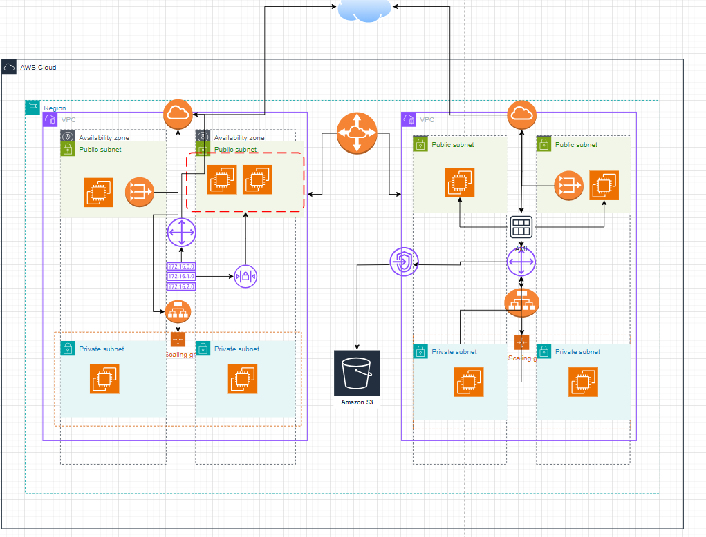
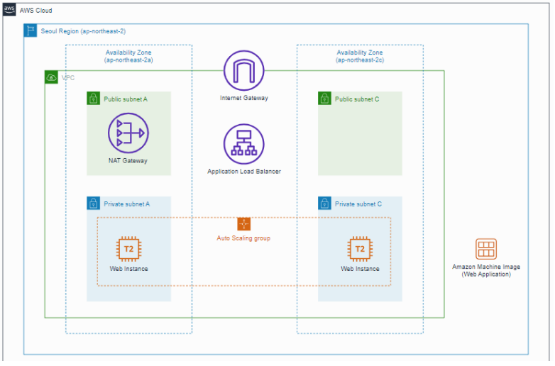

# Day10

### 지난시간 복습 진행

**VPC Peering은 1대1 연결이기 때문에 여러 VPC를 연결 할 경우 Transit Gateway로 연결한다.**

---

### Route 53

- AWS의 DNS 서비스
  - 도메인 등록
  - DNS 라우팅
  - 상태 체크(Health check)
- 도메인 등록 시 약 12,000원 정도 지불해야 하며, 최대 3일 정도 걸림
- 해당 도메인을 AWS 내 서비스(EC2, ELB, S3 등)와 연결할 수 있으며 AWS 외 요소들과도 연결 가능함
- 도메인 생성 후 레코드 세트를 생성하여 하위 도메인을 등록할 수 있음
- 레코드 세트 등록시에는 IP 주소, 도메인, ‘Alias(별칭, CNAME와 동일한 개념)’ 등을 지정하여 쿼리를 라우팅할 수 있음

### Route 53의 라우팅 정책

- Simple : 동일 레코드 내에 다수의 IP를 지정하여 라우팅 가능, 값을 다수 지정한 경우 무작위로 반환함
- Weighted : Region별 부하 분산 가능, 각 가중치를 가진 동일한 이름의 A 레코드를 만들어 IP를 다르게 줌
- Latency-based : 지연시간이 가장 적은, 즉 응답시간이 가장 빠른 리전으로 쿼리를 요청함
- Failover : A/S 설정에서 사용됨, Main과 DR로 나누어 Main 장애 시 DR로 쿼리
- Geolocation : 각 지역을 기반으로 가장 가까운 리전으로 쿼리 수행, 레코드 생성시 지역을 지정할 수 있음
- Geo-proximity : Traffic flow를 이용한 사용자 정의 DNS 쿼리 생성 가능
- Multi-value answer : 다수의 IP를 지정한다는 것은 simple과 비슷하지만, health check가 가능함(실패 시 자동 Failover)

### Alias(별칭)
- AWS만의 기능으로 Route-53 DNS 기능에 고유한 확장명을 제공
- AWS의 리소스는 도메인으로 이루어져 있는데 이 도메인을 쿼리 대상으로 지정할 수 있도록 하는 기능
- Route 53에서 별칭 레코드에 대한 DNS 쿼리를 받으면 다음 리소스로 응답(즉 다음 리소스로 Alias 지정 가능)
  - Cloudfront Distribution
  - ELB
  - Web Site Hosting이 가능한 S3 Bucket
  - Elastic Beanstalk
  - VPC Interface Endpoint
  - 동일한 Hosting 영역의 다른 Route 53 레코드
 

**인터넷을 사용하기 위해서는 고유한 IP주소를 가지고 있어야한다. 사설 IP주소를 공유기를 통해 할당 받아 외부로 접근할 수 있다.**

---

## 2주간 내용으로 Workshop진행

### 1. 클라우드 네트워크 실습한 내용을 설계도로 표현하여 제출하시오.
(S3,AMI,ec2 endpoint,VPC/subnet/routing table/igw/peering/SG/NCAL/ALB/ASG…)

### 2. 본인 prod-VPC를 구축(10.1X.0.0/16) 구축 후 Peering 하고 접속하기

- 본인 VPC생성하고 상대방 VPCID와 계정로 Peering요청 요청이 수락되면 상대방 서브넷 주소 라우팅 테이블에 추가
- EC2인스턴스에 접속하여 "ssh 사용자이름@프라이빗IP" 를 통해 상대방 VPC에 접속.

### 3. 탄력적인 인프라 구축하기
- AMI 생성을 위한 ec2 생성 : Advanced 옵션에 user_data를 붙여 넣어 ec2생성-→AMI 만들고 ec2삭제
- ALB 생성 / Target Group 구성
- 시작 템플릿 작성 (내 AMI로)
- ASG 생성
- 부하 테스트

