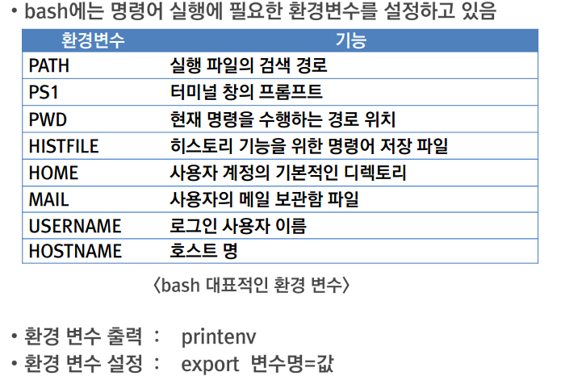
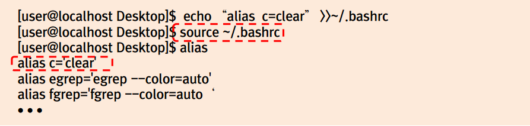
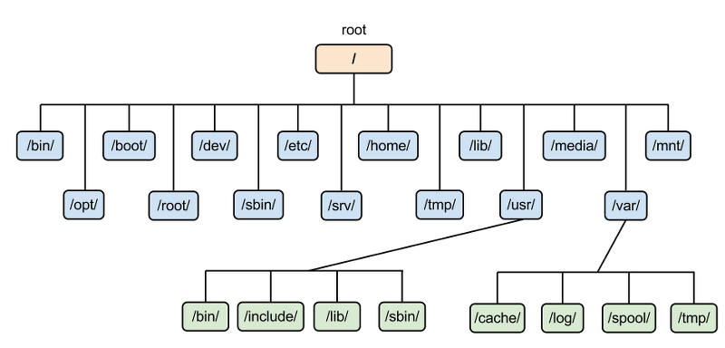

# Day11(3주차부터 2주간 리눅스교육 진행)


### MobaXterm설치
-> MobaXterm은 현존하는 최고의 SSH 접속 Tool이고, 유료 라이선스도 있지만, 무료 라이선스 또한 존재하고,
기업에서 무료 라이선스로 이용 가능

### MobaXterm(모바엑스텀) 의 몇 가지 기능들 
- SSH 원격 접속(원격 Linux 서버 접속) 가능
- FTP / SFTP 가능
- 윈도우 즐겨 찾기처럼 서버를 등록하고 로그인 및 비밀번호 등 접속 정보를 저장 후 자동 로그인 가능
- 보안 키 또한 저장 가능하여 매우 편리함

```bash
echo $PATH
-> 저장된 경로 변수 확인
```

**alias기능**
- 자주 사용하는 명령이나 긴 명령을 짧게 단축 명령으로 등록하고 대치시켜 사용할 수 있는 기능
- alias 대치명령어=기존명령어
ex) alias c='clear'

**history 명령**
```bash
history
-> 지금까지 수행한 명령 확인

!명령어번호
-> history로 확인한 명령어 번호로 명령어 다시 수행가능
```
### 작업 제어 기능
**명령어 수행 방식**
- 포그라운드 작업 : 일반적인 명령 수행 방식, 명령 수행이 완료될 때까지 다른 명령을 수행할 수 없음
- 백그라운드 작업 : 명령 끝에 `&` 기호를 붙여 수행, 여러 명령을 동시에 수행할 수 있음

### 파이프와 리다이렉션
**파이프**
- 명령이나 프로그램의 수행 결과를 다른 명령 또는 프로그램의 입력으로 전달하는 방식
**사용법 : 명령(또는 프로그램) | 명령 (또는 프로그램)**

**리다이렉션**
- 명령이나 프로그램의 입츌력을 파일로 재지정하는 방법
  
**사용법**
  - 명령 < 파일명  : 표준 입력(키보드) 대신 파일로부터 입력
  - 명령 > 파일명  : 표준 출력(모니터) 대신 파일로 새로 저장
  - 명령 >> 파일명 : 표준 출력(모니터) 대신 파일로 추가 저장
  - 명령 2> 파일명 : 표준 오류(모니터) 대신 파일로 새로 저장
  - 명령 2>> 파일명 : 표준 오류(모니터) 대신 파일로 추가 저장

**환경변수**




### 초기화 스크립트
**bash 초기화 파일**
- 로그인할 때마다 자동으로 수행하는 파일
- 윈도우의 autoexec.bat 파일과 유사
- 위치 : 사용자의 홈 디렉토리 (~)
- .bash_profile(또는 .profile)
  - 환경 변수의 설정이나 쉘이 생성될 때 자동으로 수행해야 할 명령을 등록하는 파일
- .bashrc
  - 사용자가 새로 설정하는 alias 명령을 등록하는 파일
- 변경 후 다시 로그인 없이 즉시 쉘에 적용할 때는 soruce 명령 이용
  - source ~/.bash_profile  또는 soruce ~/.bashrc



### 리눅스 디렉토리 구조




#### 주요 표준 디렉토리
- /bin : 사용자가 실행시킬 수 있는 명령의 실행 파일
- /boot : 부팅 중 사용되는 커널과 기타 부팅에 필요한 파일
- /dev : 각종 장치를 사용하는데 필요한 장치 파일
- /etc : 리눅스 시스템 환경설정과 관련된 파일
- /home : 개인 사용자를 위한 디렉토리로 사용자의 이름으로 된 서버 디렉터리
- /lib : 프로그램 개발이나 실행시 필요한 라이브러리
- /sbin : 시스템 관리에 필요한 명령, root 관리자만 이 명령들을 수행할 수 있음
- /var : 다양한 유틸리티에서 사용한는 로그 파일이나 사용자의 메일 관리하는 파일을 포함


