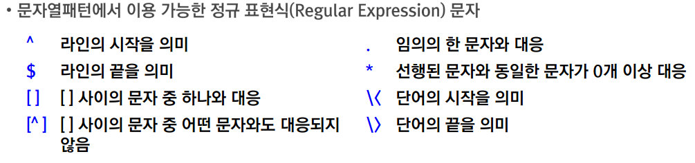

# Day12

**.vimrc vi편집기 설정파일**

### 파일과 디렉터리 생성 및 삭제

**파일생성**
- `touch 파일명`

**디렉터리 생성**
- `mkdir 디렉터리명`
  - -p : 부모디렉터리와 자식디렉터리 같이 생성 

**파일 및 디렉터리 삭제**
- `rm [옵션] 파일명 또는 디렉터리명`
  - -i : 삭제 확인을 질문
  - -r : 디렉터리 삭제
  - -f : 무조건 삭제
 
### 파일과 디렉터리 복사 및 이동

**파일 및 디렉토리 복사**
- `cp [옵션] 원본파일명 목적파일명`
- `cp [옵셔] 원본파일명1 원본파일명2 원본파일명3 .... 목적디렉터리`
  - -i : 목적 파일이 존재하는 경우 덮어씌울지 여부 질문
  - -r : 디렉터리 복사

**파일 및 디렉터리 옮기기**
- `mv 원본파일명 목적파일명`
- `mv 원본파일명1 원본파일명2 원본파일명3 ... 목적디렉터리`


**파일의 내용 전체를 확인하는 명령**
- `cat 파일명`
- `more 파일명`
- `less 파일명`

- **파일의 내용 중 앞부분 혹은 뒷 부분만 일부 확인**
- `head [ -n # ] 파일명`  # : 줄수
- `tail [ -n # ] 파일명`

**파일의 목록 및 정보를 확인하는 명령**
- `ls [옵션] [파일명]`
  - -a 숨김 파일까지 볼 수 있는 옵션
  - -l 파일의 상세 정보를 보여줌
  - -r 역순 정렬
  - -t 파일의 수정시간 기준으로 정렬
  - -R 서브 디렉터리의 파일까지 재귀적으로 보여줌

### 디스크 사용량 확인

**디스크의 남은 공간 측정**
- `df [옵션] [파일시스템]`
  - -i 파일의 크기를 블록 대신 inode로 보여줌
  - -h 블록의 크기를 알기 쉬운 형태로 보여줌(G,M,K Byte단위)
 

**디스크 사용량 측정**
- `du [옵션] 디렉토리명`
  - -s 디렉토리 사용량 총 합계
  - -h 블록의 크기를 알기 쉬운 형태로 보여줌(G,M,K Byte단위)
 
### 오픈되어 있는 파일 확인

**현재 실행중인 프로세스가 오픈 해놓은 파일이나 통신 포트에 관한 정보 출력**
- `losf [옵션] [파일명]`
  - 현재 리눅스에서 수행되고 있는 모든 프로세스의 오픈되어 있는 파일들을 출력
  - -p PID 특정 프로세스가 오픈 해놓은 파일들을 출력
  - -i :port# 특정 네트워크 포트에 관련된 프로세스 정보 출력
  - 파일명 : 해당 파일과 관련된 프로세스 정보 출력
 
## 파일 권한 다루기


### 파일 권한 제어


**파일 권한 변경**
- `chmod 모드 파일명`


**파일의 특수 권한**
- Set UID 권한
  - 파일을 실행하는 사용자가 아니라 소유자의 권한으로 실행
  - `chmod u+s 파일명 or chmod 4755 파일명`

- Set GID 권한
  - 파일을 소유한 그룹의 권한으로 실행
  - 해당 디렉토리 아래에 생성되는 파일의 소유 그룹을 디렉토리 그룹 소유자로 생성
  - `chmod g+s 파일명 or chmod 2770 파일명`

 - Sticky 권한
   - 디렉토리 권한에 w권한이 있는 사용자는 자신이 생성한 파일만 삭제
   - `chmod o+t 디렉토리명 or chmod 1777 디렉토리명`
  
### 파일의 기본 권한 설정

**리눅스에서 제공하는 파일의 기본 권한**
- 일반 파일 : rw-rw-rw-
- 실행 파일 : rwxrwxrwx
- 디렉토리 : rwxrwxrwx

**기본 권한의 변경**
- `umask [mask값(8진수)]`

### 파일의 소유권

**파일의 소유권**
- 파일을 생성한 사용자/그룹의 소유

**소유권 변경 명령**
- `chown [옵셔] 변경할_생성자:변경할_그룹 파일명`
  - -R : 디렉토리 이하에 있는 모든 파일의 소유권 변경

**링크**
- 하드 링크
  - `ln 원본파일 대상파일`
  - 하드링크는 한 파일을 복사하고 원본과 하드링크 파일은 같은 i-node를 가져 어디에서 수정을 하던지에 상관 없이 함께 수정
- 심볼릭 링크
  - `ln -s 원본파일 대상파일`
  -  소프트 링크는 원본을 삭제하게 되면 연결이 끊겨 무용지물의 파일이 되버린다. 

## 파일 및 문자열 검색

### 조건에 맞는 파일 검색

**파일 검색 도구**
- whic : 명령에 대한 실행 파일 위치를 검색
- locate : 파일의 경로가 포함된 데이터베이스로부터 파일 위치 검색
- find : 다양한 조건의 파일 검색 및 처리 도구

**which 도구**
- `which 명령어`
- 쉘의 환경변수 PATH에 등록되어 있는 경로 중 명령어의 실행파일 위치를 검색해줌

**locate도구**
- `locate 파일명 패턴`
- 파일명에 파일명 패턴이 포함된 모든 파일 검색

**find도구**
- `find 검색경로 [조건옵션]`
- 검색 경로 이하의 모든 파일을 대상으로 조건에 따른 검색


### 파일 검색 및 사후 처리

**find 이용한 검색된 파일 처리**
- `find 검색경로 [조건옵션] -exec 파일처리명령 \;`
- 검색된 파일들을 파일처리명령으로 수행
- **파일처리명령**

### 문자열 패턴 검색

**문자열 검색 도구 -grep**
- 파일 내에 문자열 패턴이 포함되어 있는 라인 출력
- `grep [옵션] 문자열패턴 파일명`
  - -e 패턴 : 다중 패턴 지정 시 이용
  - -i : 대소문자 구분 없이 검색
  - -l : 문자열 패턴이 포함되어있는 파일명만 출력
  - -v : 문자열 패턴이 포함되지 않는 라인만 출력
 


## 리눅스의 핵심, 프로세스

### 프로세스의 구조

**프로세스란?**
- "현재 실행 중인 프로그램" 을 의미
- 리눅스 운영체제의 핵심적인 구성요소
- 구분
  - 시스템 프로세스 : 운영에 필요한 시스템 프로세스
  - 사용자 프로세스 : 사용자가 수행시키는 명령이나 프로그램
- 리눅스 프로세스는 부모와 자식 프로세스의 관계로 구성됨

**프로세스 구조**
- Segment영역
  - 실행 프로그램의 코드 및 데이터가 올라가는 영역

- File Descriptor Table
  - 파일 입출력을 위한 인터페이스 영역

- U Area
  - 프로세스가 수행되는데 필요한 정보들로 구성
  - PID : 각 프로세스마다의 고유한 번호
  - PPID : 부모 프로세스의 PID
  - UID : 프로세스를 실행한 사용자의 ID
  - State : 프로세스 상태
 
### 프로세스 상태의 의미


### 프로세스의 입출력 재지정

**프로세스 구조와 표준 입출력 재지정**
- 표준 입력 재지정
  - ex) `mail root < letter`
 
- 표준 출력 재지정
  - ex) `ls>ls.out`
 
- 표준 오류 재지정
  - ex) `find / -name '*.conf' 2> find.error`
 
### 프로세스의 파이프

**프로세스간 통신 메서드**
- `ls | more`

## 프로세스 다루기

### 포그라운드 프로세스와 백드라운드 프로세스

**포그라운드 프로세스**
- 쉘이 수행이 완료될 때까지 기다리는 프로세스
- 명령 또는 프로그램을 이름 그대로 실행
- 인터럽트 신호에 의해 강제 종료할 수 있음

**백그라운드 프로세스**
- 쉘이 수행이 끝날 때까지 기다리지 않는 프로세스
- 명령 또는 프로그램 뒤에 & 기호를 붙여서 실행
- 인터럽트 신호에 의해 강제 종료할 수 없음

**포그라운드/백그라운드 프로세스 제어 명령**
- jobs : 백그라운드 프로세스 목록 확인
- fg 작업번호 : 백그라운드 프로세스를 포그라운드 방식으로 전환
- bg 작업번호 : 수행이 멈추었던 백그라운드 프로세스를 백그라운드 방식으로 실행
 
**프로세스 상태 정보 확인 명령 -ps


```bash
ps -el | awk '$2=="R" { print $0 }'
-> 2번째 항목에 "R"이 포함된 열 출력
```

### 시그널 종류

**시그널**
- 프로세스에 전달되는 소프트웨어 인터럽트
- 시그널을 발생하는 이벤트 - 오류, IO요청, 타임아웃, 키보드 및 kill 명령
- 시그널 기본 동작
  - Term : 프로그램 종료
  - core : 코어 덤프 저장 후 프로그램 종료
  - Stop : 실행 중지


**프로세스 강제 종료 도구 -kill**
- 특정 프로세스에게 시그널을 전송하는 명령
- `kill [시그널번호] PID'

**프로세스 강제 종료 도구 -killall**
- 지정된 이름으로 수행되고 있는 프로세스 모두에게 시그널을 전송하는 명령
- `killall [시그널번호] 프로세스 이름`
