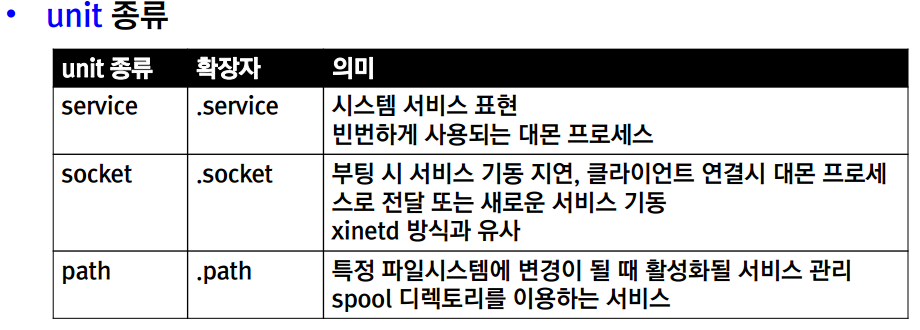
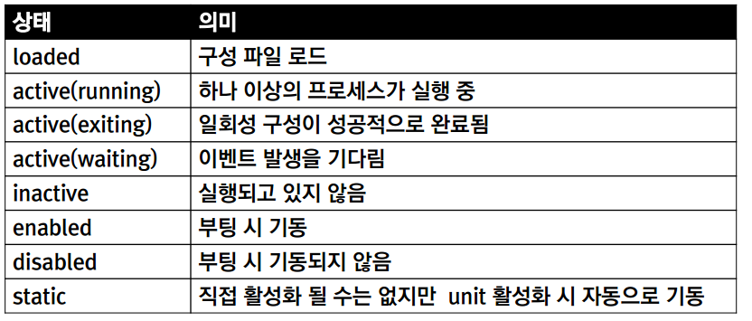
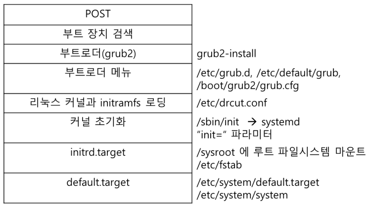

# Day14

## 시스템 서비스 관리

### 자동으로 기동되는 시스템 프로세스

#### systemd
- 새로운 init+xinetd 시스템
- 빠른 부팅을 위해 병행 처리 가능
- 별도의 서비스 요청 없이도 필요 시 데몬 프로세스 구동
- 연관된 서비스 관리
- cgroup 이용을 통한 프로세스 추적

### systemctl 과 system units

#### systemctl
- systemd의 object (unit) 관리 명령
- unit 종류



**Deamon프로세스**
- terminal과 무관하게 돌아감
- 무한루프
- systemctl로 관리

### 서비스 상태

`systemctl status name.type`

- status종류



### 서비스 제어

```bash
systemctl status name.service 상태보기
          stop                멈추기
          start               시작
          restart             서비스 종료 후 재시작
          reload              설정파일 업데이트
          mask/unmask
          enable/disable

### 부팅 과정 제어



