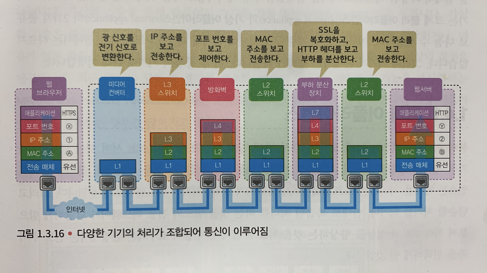

# Day6

지난주 복습 진행

Serverless : 서버가 없는 것이 아니라 고객이 관리할 서버가 없는것 CSP에서 서버를 관리해주는 방식

WindowEC2 생성 및 연결 실습 진행

---

## 2주차부터는 위 책으로 교육 진행

캡슐화와 비캡슐화 
- 송신 단말은 애플리케이션 계층에서 순서대로 각 계층에서 페이로드에 헤더를 붙여 PDU로 만들어 한 단계 아래 계층으로 전달
해더를 추가하는 처리를 **캡슐화**라고 한다.

PDU :  전 계층에서의 전송단위

페이로드 : PDU에서 헤더 부분을 뺀 데이터 부분

커넥션 타입 : 확실하게 정해진 순서를 따르므로 전소에는 다소 시간이 걸리지만 데이터를  확실하게 전송한다.

커넥션리스 타입 : 곧바로 데이터를 보내면서 커넥션을 확립한 뒤 마음대로 종료합니다.

   

### 패킷분석도구 설치 및 패킷분석(WireShark)

   

**물리 계층에서 동작하는 기기**  
물리 계층은 케이블이나 커넥터 형태, 핀 할당 등 물리적인 사양에 관해 모두 정의되어 있는 계층

- NIC(Network Interface Card) : 모든 네트워크 단말은 애플리케이션과 운영체제가 처리한 패킷을 NIC카드를 이용해 LAN 케이블이나 전파로 보낸다.

- 리피터 : 파형을 한 번 더 증폭해서 정돈한 뒤 다른 쪽으로 전송한다.

- 리피터 허브 : 전달받은 패킷의 복사본을 그대로 다른 모든 포트에 전송하는 기기.

- 미디어 컨버터 : 전기 신호와 광 신호를 서로 교환하는 기기.

- 액세스 포인트 : 패킷을 전파로 변조/복조하는 기기.

**데이터링크 계층에서 동작하는 기기**  
데이터링크 계층은 물리 계층의 신뢰성을 확보하고, 같은 네트워크에 있는 단말과 연결할 수 있도록 하는 계층

- 브리지 : 포트와 포트 사이의 '다리' 역할을 담당
- MAC주소 : 네트워크 세그먼트의 데이터 링크 계층에서 통신을 위한 네트워크 인터페이스에 할당된 고유 식별자

**L2 스위치** : 많은 포트를 가진 브리지로, 단말에서 받아들인 프레임의 MAC 주소를 MAC 주소 테이블로 관리하고, 전송 처리한다.

**네트워크 계층에서 동작하는 기기**  
네트워크 계층은 네트워크와 네트워크를 연결하는 계층

- 라우터 : 단말로부터 받아들인 IP 패킷의 IP 주소를 보고, 자신이 속한 네트워크를 넘어 범위에 있는 단말로 전달하는 역할.
- 라우팅 : IP 패킷을 패기지 릴레이해서 목적지로 날려 보낸다.
- 라우팅 테이블 : 컴퓨터 네트워크에서 목적지 주소를 목적지에 도달하기 위한 네트워크 노선으로 변환시키는 목적으로 사용

**L3 스위치** : MAC 주소 테이블과 라우팅 테이블을 조합한 정보를 FPGA나 ASIC등의 패킷 전송 처리 전용 하드웨어에 기록하고, 그 정보를 기반으로 스위칭 혹은 라우팅한다.

VLAN : 물리적 위치와 상관없이 논리적으로 네트워크를 분리하는 기술

**트랜스포트 계층에서 동작하는 기기** 
트랜스포트 계층은 애플리케이션을 식별하고, 그 요건에 맞게 통신 제어하는 계층.

- Load Balnace
- 방화벽 : 단말 사이에서  교환되는 패킷의 IP 주소나 포트 번호를 보고, 통신을 허가하거나 차단한다.

AWS
- 보안그룹
- Subnet(stateful)기반 / NACL(stateless)

Stateless : 요청 정보를 따로 저장하지 않아 응답하는 트래픽도 제어를 해줘야 한다 (NACL) 
Stateful : 요청 정보를 저장하여 응답하는 트래픽 제어를 하지 않는다 (Security Group)

**애플리케이션 계층에서 동작하는 기기** 
사용자에게 애플리케이션을 제공하는 계층.

- 차세대 방화벽 : 다양한 정보를 애플리케이션 레벨에서 해석함에 따라, 전통적인 방화벽보다 높은 차원의 보안, 운용 관리성을 제공한다.
- WAF(Web Application Firewall) : 클라이언트와 서버 사이에서 교환되는 정보의 움직임을 애플리케이션 레벨에서 하나하나 검사하고 필요에 따라 차단.
- L7스위치 : 받아들인 패킷을 load balancing이라는 방법에 근거해, 뒤쪽에 있는 여러 서버들로 나눔으로써 시스템 전체적으로 처리 가능한 트래픽양을 확장한다.
또한 헬스체크를 통해 정기적으로 서버를 감시함으로써, 장애가 발생한 서버를 부하 분산 대상에서 제외해 서비스의 가용성을 향상함을 목표로 한다.

---

물리 어플라이언스
-> 눈에 보이는, 다시 말해 '상자 모양의 장치'이다.

가상 어플라이언스
-> 가상화 기술을 제공하는 소프트웨어 위에서 동작하는 네트워크 기기.

### 네트워크 형태

**LAN** : 가정이나 기업 등 한정된 범위의 네트워크를 의미한다.

**WAN** : 거리상 멀리 떨어진 범위의 네트워크를 말한다. 

**폐역 VPN망** : LAN과 LAN을 연결하는 네트워크를 의미한다.

