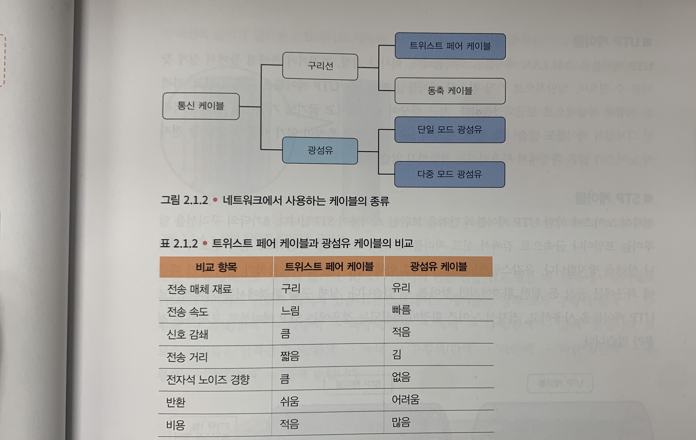
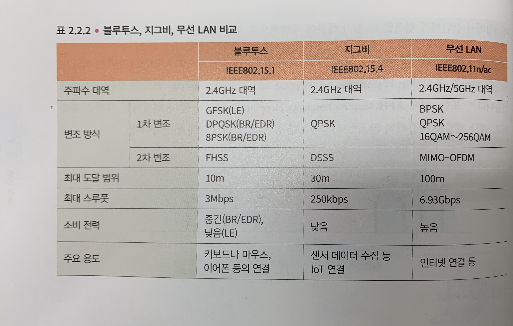

# Day7

### AWS Global 수준 Service
- IAM
- CloudFront(CDN)
- S3bucket
- Route53
- WAF
- Shield

### AWS Region 수준 Service
- S3
- VPC
- EFS

### AWS AZ 수준 Service
- Subnet
- Raute table
- EC2
- NACL

**AWS Service Quotas** : 사용하여 할당량을 보고 관리할 수 있습니다.AWS 서비스중앙 위치에서. 에서 제한이라고도 하는 할당량AWS 서비스는 사용자의 리소스, 작업, 작업, 항목의 최댓값으로
, AWS 계정. 각AWS 서비스할당량을 정의하고 해당 할당량에 대한 기본값을 설정합니다. 비즈니스 요구 사항에 따라 서비스 할당량 값을 늘릴수 있다.

**네트워크에서 사용하는 케이블의 종류**

### 케이블에 따른 분류
- 다중 모드 광섬유 케이블
- 단일 모드 광섬유 케이블
- MPO 케이블

### 두 가지 통신 방식
- **반이중화 통신** : 반이중화 통신은 송신할 때와 수신할 때, 그 해당 통신 방향을 전환해서 사용하는 방식
- **전이중화 통신** : 전이중화 통신은 송신용 수신용 전송로를 별도로 준비하고, 송싱과 수신을 동신에 수행하는 방식

## 무선LAN(IEEE802.11)

### 주파수 대역
- **WI-FI** : 무슨 LAN 제품을 보급하기 위한 목적으로 설립된 미국업계 단체인 와이파이 얼라이언스가 수행하는 상호 연결 설정을 의미  
- **2.4GHz** : 주파수 대역이 겹치지 않는 3개의 채널을 선택해서 사용한다.  
- **5GHz** : 각 채널은 완전히 다른 파장을 사용하기 때문에 19개 채널을 모두 동시에 사용할 수 있다.

### 변조 방식
- **1차변조** : 일정 주파수로 된 기준 파형인 '반송파'와 디지털 데이터를 조합해 전파에 싣기 위한 '변조파'를 만든다.
- **2차변조** : 1차 변조로 만든 파형을 노이즈에 지지 않도록 하기 위한 변조

*CSMA/CD는 충돌한 후 무언가를 시도하려 하는 것에 비해, CSMA/CA는 충돌하기 전 무언가를 시도하려는 것이다.

### 고속화 기술
- 가드인터벌 : 비트를 실은 전파의 가장 마지막 부분을 일정 시간 복사해서, 전파 앞부분에 붙이는 기능
- 채널 본딩 : 인접한 채널을 동시에 사용함으로써 전송 속도를 향상시키는 기술.
- MIMO : 공간 스트림을 통시에 여럿 사용함으로써, 전송 속도를 높이는 기술
- 빔 포밍 : 스마트폰이나 PC 등 무슨 LAN 단말에 핀 포인트로 전파를 보내는 기능

### 블루투스,지그비 무선 LAN 비교

