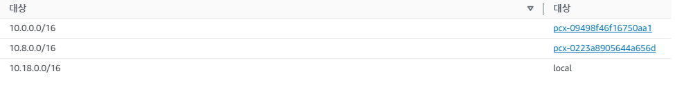

# Day8

### IPv6
- 인터넷 프로토콜 스택 중 네트워크 계층의 프로토콜로서 버전 6 인터넷 프로토콜(version 6 Internet Protocol)로 제정된 차세대 인터넷 프로토콜

**CIDR(Classless Inter-Domain Routing)** : 인터넷상의 데이터 라우팅 효율성을 향상시키는 IP 주소 할당 방법 

---

## AWS VPC 실습 진행

VPC2개 생성

2개의 EC2를 생성하는데 하나는 VPC public subnet을 기반으로 
하나는 VPC private subnet을 기반으로

이후 2개의 VPC 피어링진행

이후 public EC2의 **서브넷 라우팅 테이블**에 private 서브넷 주소 추가 
반대로 private에도 public 서브넷 주소 추가

public에서 private으로 접속해 ping을 보내기 위한 인바운드 규칙 추가

ICMP 프로토콜을 추가해 ping을 보낼 수 있게 포트를 열어준다.

이후 public subnet에서 private에 Ping이 정상적으로 가는걸 확인할 수 있다.

public에서 private로 접속하기 위해 pirvate의 키페어를 복사하여 vi편집기로 파일 생성 후 
"chmod 400"으로 권한 수정 하고, "ssh -i dsdw.pem 유저이름@프라이빗 아이피" 명령어로 private에 접속할 수 있다.

