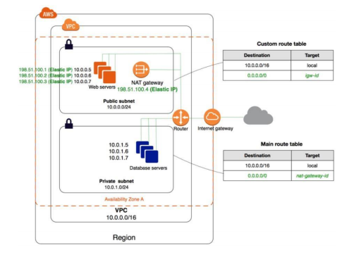
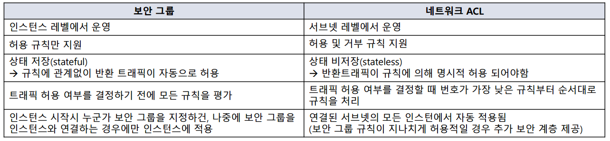
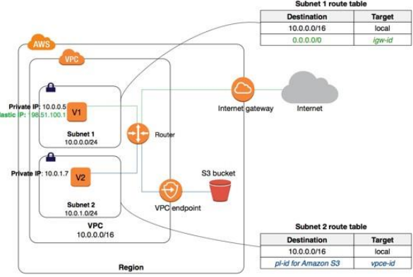

# Day9

## Virtual Private Cloud(VPC)
- AWS의 계정 전용 가상 네트워크 서비스
- VPC 내에서 각종 리소스(EC2,RDS,ELB등)을 시작할 수 있으며 다른 가상 네트워크와 논리적으로 분리되어 있음
- S3, Cloudfront 등은 非VPC 서비스로 VPC 내에서 생성되지 않음
- 각 Region 별로 VPC가 다수 존재할 수 있음
- VPC는 하나의 사설 IP 대역을 보유하고, 서브넷을 생성하며 사설 IP 대역 일부를 나누어 줄 수 있음
- 허용된 IP 블록 크기는 /16 ~ /28
- 권고하는 VPC CIDR 블록

### Subnet
- VPC 내 생성된 분리된 네트워크로 하나의 서브넷은 하나의 AZ에 연결된
- VPC가 가지고 있는 사설 IP 범위 내에서 '서브넷'을 쪼개어 사용가능
- 실질적으로 리소스들은 이 서브넷에서 생성이 되며 사설 IP를 기본적으로 할당받고 필요에 따라 공인 IP를 할당받음
- 하나의 서브넷은 하나의 라우팅 테이블과 하나의 NACL을 가짐
- 서브넷에서 생성되는 리소스에 공인 IP를 자동할당 여부를 설정할 수 있음
- 각 서브넷의 CIDR블록에서 IP 주소와 마지막 IP 주소는 예약 주소로 사용자가 사용할 수 있음
- **기본은 Private이지만 라우팅테이블에 따라 Public으로 변경가능**

### ENI(Elastic Network Interface)
- 가상 네트워크 인터페이스
- VPC 내 리소스들은 ENI와 사설 IP를 기본적으로 할당받음
- 사성 IP 주소는 추가 할당 가능하며 공인 IP역시 나중에 할당 가능

### Routing table
- 서브넷 내의 트래핑이 전송되는 위치를 결정하는 라우팅의 규칙 집합
- 라우팅 테이블은 기본적으로 VPC의 범위에 해당하는 범위를 기본 라우팅으로 가지며 이를 'Local'로 표시함
- 또한 Internet Gateway, NAT Gateway, VPC Endpoint, Peering 등을 설정하고 그 서비스로 트래픽을 보내도록 라우팅 설정할 수 있음
- '0.0.0.0/0'은 default routing을 뜻하며 트래픽이 가자고 하는 목적지가 라우팅 테이블에 없는 경우 사용하는 라우팅이며 보통 Internet Gateway나 NAT Gateway로 외부 인터넷을 지정할 때 사용
- 하나의 서버넷은 하나의 라우팅 테이블ㅇ만 가지지만, 하나의 라우팅 테이블은 다수의 서브넷을 가질 수 있음
- Public Subnet의 라우팅 테이블에는 인터넷 게이트 웨이로의 라우팅이 있으며, Private Subnet에서 외부 인터넷 통신이 필요할 경우 NAT Gateway로의 라우팅이 잡혀 있음

### Internet Gateway
- VPC 내 리소스가 외부 인터넷을 사용하고자 할 때 사용하는 게이트웨이
- 인터넷 게이트웨이가 없으면 외부 인터넷을 사용할 수 없음
- 다만 인터넷 게이트웨이가 있다 하더라도, VPC 내 리소스가 공인 IP를 가지고 있지 않다면 인터넷 사용 불가능
- 또한 위의 설정을 모두 했음에도 인터넷이 제대로 되지 않는다면, 보안그룹과 Network ACL을 확인 해야함

### NAT Gateway
- 외부에서 접촉이 원천적으로 차단되어 있는 Private Subnet에서 인터넷 접속을 통해야 할 경우 사용하는 게이트웨이
- VPC 내부 리소스가 NAT Gateway를 통해 인터넷을 접속할 수 있지만, 외부에서 NAT Gateway를 통해 VPC 내부로 들어올 수 없음
- 인터넷이 연결된 Public subnet에 NAT Gateway를 생성한 후, Private Subnet의 라우팅 테이블에 '0.0.0.0/0'에 대하여 라우팅을 NAT Gateway로 잡아주면 사용 가능
- CloudWatch를 이용하여 모니터링 가능

### NAT Instance
- Public Subnet에 생성된 Nat Gateway 대신 EC2 인스턴스를 사용하는 방법
- Public Subnet에 공인 IP를 가진 특수한 인스턴스를 게이트웨이로 삼고, Private Subnet의 라우팅 테이블에'0.0.0.0/0'에 대하여 NAT Instance를 Gateway로 설정한 후, 'Src'DeskCheck' 속성을 비활성화해야 함
- 인스턴스이기 때문에 보안그룹의 설정을 적용 받으므로 트래픽을 제어할 수 있음

**EIP** : 인터넷을 통해 접속할 수 있는 고정적인 공인 IP 주소를 할당할 수 있고, 인스턴스에 연결할 수 있는 서비스

**bastion 서버/호스트** : 차단 소프트웨어가 설치되어 내부와 외부 네트워크 사이에서 일종의 게이트 역할을 수행하는 호스트

### 보안그룹
- VPC 내 인스턴스에 대한 인바운드 및 아웃바운드 트래픽을 제어하는 가상 방화벽
- 서브넷 수준이 아닌 인스턴스 수준에서 작동하기 때문에 각 인스턴스를 서로 다른 보안그룹 지정할 수 있음
- 기본적으로 모든 인바운드 트래픽을 거부하고 모든 아웃바운드 트래픽을 허용
- 인스턴스당 최대 5개의 보안그룹을 설정할 수 있음
- 보안그룹의 가장 큰 특성은 이른바 'Stateful'로 인바운드 트래픽과 아웃바운드 트래픽에 규칙을 지정할 수 있는 것이다
- 즉 인파운드에는 HTTP(80) 포트가 허용되어 있으나, 아웃바운드에 없는 경우 HTTP 트래픽이 '외부에서 들어왔다가 나오는 것
- 허용 규칙만 존재하며 거부 규칙이 존재하지 않음
- Source IP, Protocol, Port 등을 설정할 수 있음
- 설정 변경 시 즉시 적용됨

**방화벽은 3.4계층에서 동작**

### NACL

### Security Group vs NACL

### VPC Peering

### VPC Endpoint

**2계층에서 Peering** 
**3계층에서 라우팅테이블 수정** 
**4계층에서 보안그룹 조정**

---

### AWS 실습 진행

**Internet Gateway**생성 
